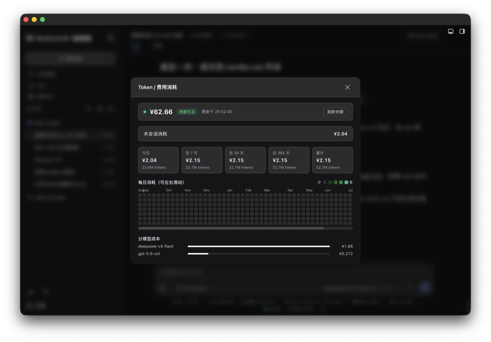

# dsh-heatmap-cost

DeepSeek Harness 插件：**Token / 费用消耗热力图**。



在 dsh Web UI **输入框下方的统计条（命中率 / 输入输出 token 所在行）** 实时显示：

- **账户余额**（三色状态点：绿=充足 / 黄=偏低 / 红=告急，点击弹层内的「刷新余额」可手动强刷）
- **本会话估算消耗**（按模型、按 DeepSeek 官方单价估算，含谷峰计费）
- **📊 热力图按钮**：点击打开 GitHub 风格弹层 —— 近 N 天（默认 365 天）每日 token / 金额网格，附今日 / 近 7 / 30 / 365 天 / 累计汇总、余额、分模型成本。

## 特性

- **全量历史计费**：扫描 `$DSH_HOME/sessions` 下**所有持久化会话日志**（`session.jsonl.zstd`，zstd 多帧解压），从开始使用 DSH 起累计，跨会话、跨天、跨 Agent 预设。
- **四维聚合**：累计消耗（总金额 / 总 token / 请求数 / 会话数）+ 按 Agent 预设消耗（standard / liangshen / code…）+ 按模型调用费用 + 按天热力图。
- **持久化账本**：按会话缓存聚合结果到 `$DSH_HOME/storages/dsh-heatmap-cost/ledger.json`，以文件指纹（size + mtime）增量重扫，重启不丢、秒级返回。
- **模型筛选**：热力图可按模型着色查看（全部 / 具体模型）。
- **日历年对齐**：热力图每列 = 一个完整日历周（周日~周六），同周日期不会跨列错位。
- 内置 DeepSeek V4 定价表（`deepseek-v4-flash` / `deepseek-v4-pro`，CNY / USD，谷峰自动切换：北京时间 09:00~12:00、14:00~18:00 为峰时，其余时段 5 折）。
- 密钥复用 Harness credentials（`DEEPSEEK_API_KEY`），无需在配置里写密钥。
- 纯 CSS 网格热力图，自适应明暗主题（CSS 变量），无额外依赖（Node 内置 zstd）。

## 安装

```sh
dsh plugin --profile desktop add <本目录>
# 或 dsh plugin --profile web add <本目录>
```

重启 `dsh web` 后生效。

## 配置（可选）

写进 `$DSH_HOME/profiles/<profile>/cordis.patch.yml`：

```yaml
- id: dsh-heatmap-cost
  config:
    warningThreshold: 10      # 余额预警阈值(低于此值显示黄色)
    dangerThreshold: 5        # 余额告急阈值(低于此值显示红色)
    refreshIntervalMs: 300000 # 服务器向 DeepSeek 查询余额的频率(毫秒)
    heatmapDays: 365          # 热力图覆盖的天数(7~400)
    currency: CNY             # 计价货币(CNY / USD)
    apiKeyRef: DEEPSEEK_API_KEY  # credentials / 环境变量引用名
    baseUrl: https://api.deepseek.com
```

自定义单价（每 100 万 tokens）：

```yaml
    prices:
      my-model:
        cacheHit: 0.2
        cacheMiss: 2
        output: 8
```

## HTTP 路由

- `GET /cost-heatmap` — 余额 + 当前会话投影 + 热力图数据（浏览器轮询用）
- `POST /cost-heatmap?force=1` — 强刷余额
- `GET|POST /cost-heatmap/config` — 读写运行配置

## 说明

- 若请求走中转 provider（非 DeepSeek 官方 API），`/user/balance` 可能查不到真实扣费，余额显示会失效；热力图（token 用量）不受影响。
- 热力图数据来自宿主内存中的会话日志，重启后自动重建。
